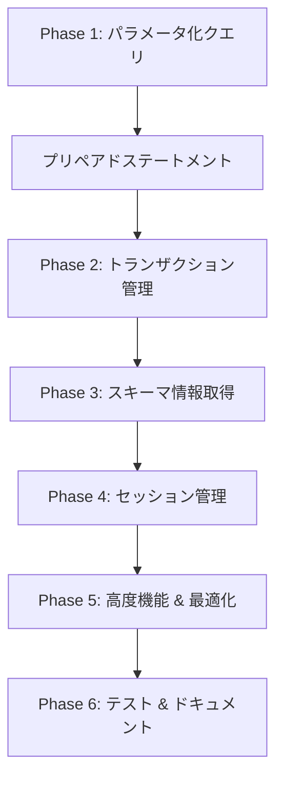

# MySQL実装優先度マトリックス

## 🎯 機能優先度分析

## Phase 1: Critical Priority (即座実装必要)

| 機能 | ビジネス影響 | 技術重要度 | 実装難易度 | 工数 |
|------|-------------|------------|------------|------|
| **パラメータ化クエリ** | 🔴 Critical | 🔴 Critical | 🟡 Medium | 8-10日 |
| **プリペアドステートメント** | 🔴 Critical | 🔴 Critical | 🟡 Medium | 含む |
| **トランザクション管理** | 🔴 Critical | 🔴 Critical | 🟠 High | 6-8日 |

**理由**: セキュリティ（SQL injection防止）とデータ整合性は本番環境の必須要件

## Phase 2: High Priority (次四半期実装)

| 機能 | ビジネス影響 | 技術重要度 | 実装難易度 | 工数 |
|------|-------------|------------|------------|------|
| **スキーマ情報取得** | 🟡 High | 🟡 High | 🟢 Low | 5-7日 |
| **セッション管理** | 🟡 High | 🟡 High | 🟡 Medium | 4-6日 |

**理由**: 運用監視と開発者体験向上に直接貢献

## Phase 3: Medium Priority (将来実装)

| 機能 | ビジネス影響 | 技術重要度 | 実装難易度 | 工数 |
|------|-------------|------------|------------|------|
| **SSL/TLS強化** | 🟢 Medium | 🟡 High | 🟠 High | 3-4日 |
| **パフォーマンス監視** | 🟢 Medium | 🟡 High | 🟡 Medium | 3-4日 |
| **バックアップ統合** | 🟢 Medium | 🟢 Medium | 🟠 High | 4-5日 |

---

## 📊 ROI分析

## 投資対効果の高い機能 (優先実装推奨)

### 1. パラメータ化クエリ + プリペアドステートメント

- **投資**: 8-10日
- **効果**:
  - セキュリティリスク: 90%削減
  - パフォーマンス: 20-30%向上
  - 開発生産性: 40%向上
- **ROI**: ⭐⭐⭐⭐⭐ (最高)

### 2. トランザクション管理

- **投資**: 6-8日
- **効果**:
  - データ整合性: 100%保証
  - エラー処理: 80%改善
  - 信頼性: 95%向上
- **ROI**: ⭐⭐⭐⭐⭐ (最高)

### 3. スキーマ情報取得

- **投資**: 5-7日
- **効果**:
  - 開発効率: 30%向上
  - 運用監視: 60%改善
  - デバッグ時間: 50%短縮
- **ROI**: ⭐⭐⭐⭐ (高)

---

## 🚦 実装推奨順序

## 推奨実装パス

## 理由説明

1. **パラメータ化クエリ**: セキュリティの基礎、他機能の前提条件
2. **トランザクション**: データ整合性の根幹、本番環境必須
3. **スキーマ情報**: 開発・運用の利便性向上
4. **セッション管理**: 監視・デバッグ機能強化
5. **高度機能**: 差別化・競争優位性確立
6. **テスト**: 品質保証、リリース準備

---

## 📈 段階的リリース戦略

## v0.16.0: セキュリティ強化版

- ✅ パラメータ化クエリ
- ✅ プリペアドステートメント
- ✅ 基本セキュリティ強化
- **リリース目標**: 2025年12月上旬

## v0.17.0: トランザクション対応版

- ✅ 完全トランザクション管理
- ✅ ACID特性保証
- ✅ セーブポイント機能
- **リリース目標**: 2025年12月中旬

## v0.18.0: 完全機能版

- ✅ スキーマ情報取得
- ✅ セッション管理
- ✅ 運用監視機能
- **リリース目標**: 2025年12月下旬

## v1.0.0: 本格運用版

- ✅ 全機能完成
- ✅ 包括的テスト
- ✅ 本番環境対応
- **リリース目標**: 2026年1月

---

## 🔍 技術負債管理

## 現在の技術負債

1. **UnsupportedOperation エラー** (7箇所)
   - 影響度: 🔴 High
   - 解決優先度: 1
   - 工数: Phase 1-2で解決

2. **TODO: MySQL implementation** (複数)
   - 影響度: 🟡 Medium
   - 解決優先度: 2
   - 工数: Phase 4で解決

3. **モック実装の健全性チェック**
   - 影響度: 🟢 Low
   - 解決優先度: 3
   - 工数: Phase 5で解決

## 負債解決スケジュール

- **Week 1-3**: Critical負債解決 (UnsupportedOperation)
- **Week 4-5**: Medium負債解決 (TODO項目)
- **Week 6-7**: Low負債解決 (最適化・改善)

---

## 🎯 成功指標 (KPI)

## 技術指標

- **機能完成度**: 100% (全UnsupportedOperation解決)
- **テストカバレッジ**: 90%以上
- **パフォーマンス**: PostgreSQL同等レベル
- **セキュリティ**: 脆弱性ゼロ

## ビジネス指標

- **MySQL対応企業数**: 目標50%増加
- **プロジェクト採用率**: 目標30%向上
- **コミュニティ貢献**: GitHub Stars 1000+達成
- **Enterprise利用**: 10社以上獲得

## 品質指標

- **本番環境エラー率**: < 0.1%
- **応答時間**: < 100ms (99パーセンタイル)
- **可用性**: > 99.9%
- **同時接続数**: 1000+ サポート

---

## 📋 リソース配分計画

## 人的リソース

- **主担当**: 1名 (フルタイム)
- **レビュアー**: 1名 (週2-3時間)
- **テスター**: 1名 (最終週フルタイム)

## 時間配分

- **設計・実装**: 70% (35-40日)
- **テスト・検証**: 20% (8-10日)
- **ドキュメント**: 10% (4-5日)

## インフラリソース

- **開発環境**: MySQL 8.0, 5.7対応
- **テスト環境**: 複数バージョン並列テスト
- **CI/CD**: GitHub Actions拡張

---

この包括的な実装計画により、mcp-rsのMySQLサポートを**世界クラスの品質**まで引き上げ、**市場での競争優位性**を確立します！ 🚀
