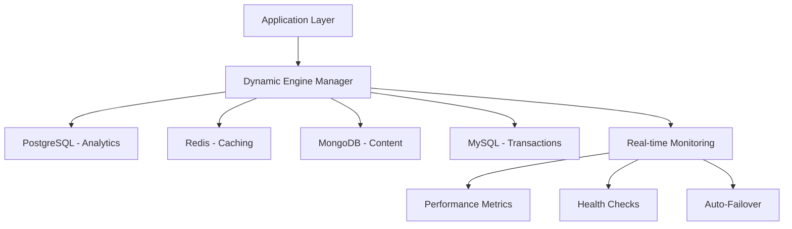

# Database Integration Guide

**Multi-Engine Database System with Enterprise Security**

---

## Overview

MCP-RS provides comprehensive database integration supporting 5 major database engines with unified API access and enterprise-grade security features.

## Supported Database Engines

### 🗄️ **PostgreSQL**
- **Type**: Relational Database
- **Features**: Advanced SQL, ACID transactions, JSON support
- **Use Cases**: Enterprise applications, complex queries, data integrity
- **Status**: ✅ Fully Implemented

### 🐬 **MySQL** 
- **Type**: Relational Database
- **Features**: Web-scale performance, replication, clustering
- **Use Cases**: Web applications, content management, e-commerce
- **Status**: ✅ Fully Implemented

### 🔴 **Redis**
- **Type**: In-Memory Key-Value Store
- **Features**: Sub-millisecond latency, data structures, clustering
- **Use Cases**: Caching, session storage, real-time analytics
- **Implementation**: 558 lines of code
- **Status**: ✅ Fully Implemented

### 🍃 **MongoDB**
- **Type**: Document-Oriented NoSQL
- **Features**: Flexible schemas, aggregation pipelines, sharding
- **Use Cases**: Content management, IoT data, flexible data models
- **Implementation**: 952 lines of code
- **Status**: ✅ Fully Implemented

### 📄 **SQLite**
- **Type**: Embedded Database
- **Features**: Zero-configuration, serverless, cross-platform
- **Use Cases**: Development, testing, mobile applications
- **Status**: ✅ Basic Implementation

## Security Features

### 🛡️ **6-Layer Security Architecture**

All database operations are protected by:

1. **🔐 AES-GCM-256 Encryption**: Military-grade encryption for sensitive data
2. **⚡ Token Bucket Rate Limiting**: DDoS protection with configurable limits
3. **🔒 TLS 1.2+ Enforcement**: Mandatory secure transport
4. **🛡️ SQL Injection Protection**: 11 attack pattern detection
5. **🚫 XSS Attack Protection**: 14 attack pattern detection
6. **📊 Comprehensive Audit Logging**: All operations logged with tamper-resistance

### 🔍 **Security Monitoring**
- Real-time threat detection
- Anomaly detection and alerting
- Security event correlation
- Compliance reporting

## Dynamic Database Engine Switching

🚀 **Enterprise Feature**: Industry-leading zero-downtime database engine switching with intelligent failover and real-time optimization.

### Core Capabilities

#### **Zero-Downtime Switching**
- Seamless engine transitions without service interruption
- Transaction coordination across engines
- Connection state preservation
- Automatic rollback on failure

#### **Intelligent Monitoring**
- Real-time performance metrics collection
- Health status monitoring for all engines
- Automatic degradation detection
- Predictive failure analysis

#### **Policy-Based Automation**
- Performance-triggered switching
- Time-based engine selection
- Load-aware engine routing
- Custom business logic integration

### Switching Strategies

| Strategy | Trigger | Use Case |
|----------|---------|----------|
| **Performance** | Response time > threshold | High-traffic optimization |
| **Load-Based** | Connection count > limit | Auto-scaling responses |
| **Time-Based** | Scheduled intervals | Cost optimization |
| **Manual** | Administrative command | Maintenance operations |
| **Failover** | Engine health failure | Disaster recovery |

### Architecture Benefits

#### **Multi-Engine Optimization**


#### **Enterprise Integration**
- **Kubernetes Ready**: Native container orchestration support
- **Prometheus Metrics**: Full observability integration
- **Grafana Dashboards**: Real-time performance visualization
- **PagerDuty Alerts**: Automated incident management

## Key Features

### ⚡ **Multi-Engine Workflows**
```json
// Cache-aside pattern with PostgreSQL + Redis
{
  "workflow": "cache_aside",
  "primary": "postgresql",
  "cache": "redis",
  "ttl": 3600
}
```

### 📊 **Health Monitoring**
- Real-time database health checks
- Performance metrics collection
- Connection pool monitoring
- Automated alerting

### 🔧 **Connection Management**
- Advanced connection pooling
- Automatic failover handling
- Load balancing across replicas
- Connection lifecycle management

## Database Tools

### Core Operations

#### `execute_query` - Execute SELECT Queries
```json
{
  "tool": "execute_query",
  "arguments": {
    "sql": "SELECT * FROM users WHERE active = $1",
    "params": [true],
    "engine": "postgresql"
  }
}
```

#### `execute_command` - Data Modification
```json
{
  "tool": "execute_command",
  "arguments": {
    "sql": "INSERT INTO users (name, email) VALUES ($1, $2)",
    "params": ["John Doe", "john@example.com"],
    "engine": "postgresql",
    "transaction": true
  }
}
```

#### `begin_transaction` - Transaction Management
```json
{
  "tool": "begin_transaction",
  "arguments": {
    "engine": "postgresql",
    "isolation_level": "REPEATABLE_READ"
  }
}
```

### Engine Management

#### `list_engines` - Available Engines
```json
{
  "tool": "list_engines",
  "arguments": {}
}
```

#### `switch_engine` - Change Active Engine
```json
{
  "tool": "switch_engine",
  "arguments": {
    "engine_id": "redis"
  }
}
```

## Configuration

### Multi-Engine Setup
```toml
[database]
# PostgreSQL primary database
[[database.engines]]
id = "primary"
type = "postgresql"
host = "localhost"
port = 5432
database = "myapp"
username = "user"
password = "password"

# Redis cache
[[database.engines]]
id = "cache"
type = "redis"
host = "localhost"
port = 6379
database = 0

# MongoDB documents
[[database.engines]]
id = "documents"
type = "mongodb"
uri = "mongodb://localhost:27017"
database = "docs"
```

### Security Configuration
```toml
[database.security]
enable_sql_injection_detection = true
enable_audit_logging = true
threat_intelligence_enabled = true
max_query_length = 10000

[database.security.encryption]
enable_column_encryption = true
master_key_rotation_days = 90
```

## Use Cases

### 🏪 **E-Commerce Platform**
- **PostgreSQL**: Product catalog, orders, inventory
- **Redis**: Shopping carts, session data, price caching
- **MongoDB**: Product reviews, user-generated content

### 📰 **Content Management System**
- **MySQL**: Articles, users, permissions
- **Redis**: Page caching, view counters
- **MongoDB**: Media metadata, search indexes

### 📊 **Analytics Platform**
- **PostgreSQL**: User data, transactions
- **Redis**: Real-time metrics, leaderboards  
- **MongoDB**: Event logs, flexible schemas

## Performance Optimization

### 🚀 **Best Practices**
1. **Use appropriate engines** for different data types
2. **Implement connection pooling** for high-traffic apps
3. **Cache frequently accessed data** in Redis
4. **Use read replicas** for scaling read operations
5. **Monitor and optimize slow queries**

### 📈 **Monitoring Metrics**
- Query execution time
- Connection pool utilization
- Cache hit/miss ratios
- Transaction throughput
- Error rates and patterns

## Getting Started

1. **Configure Database Engines**: Set up connection details in `mcp-config.toml`
2. **Test Connections**: Use health check tools to verify connectivity
3. **Implement Workflows**: Design multi-engine workflows for your use case
4. **Monitor Performance**: Set up monitoring and alerting
5. **Scale Operations**: Use connection pooling and read replicas

## Related Documentation

- **[Complete Database Guide](https://github.com/n-takatsu/mcp-rs/blob/main/project-docs/database-guide.md)** - Comprehensive developer documentation
- **[API Reference](./api/index.html)** - Complete API documentation
- **[Security Guide](./security.html)** - Enterprise security features
- **[Architecture](./architecture/index.html)** - System design overview

---

**Version**: 0.15.0  
**Status**: Production Ready  
**Last Updated**: November 7, 2024